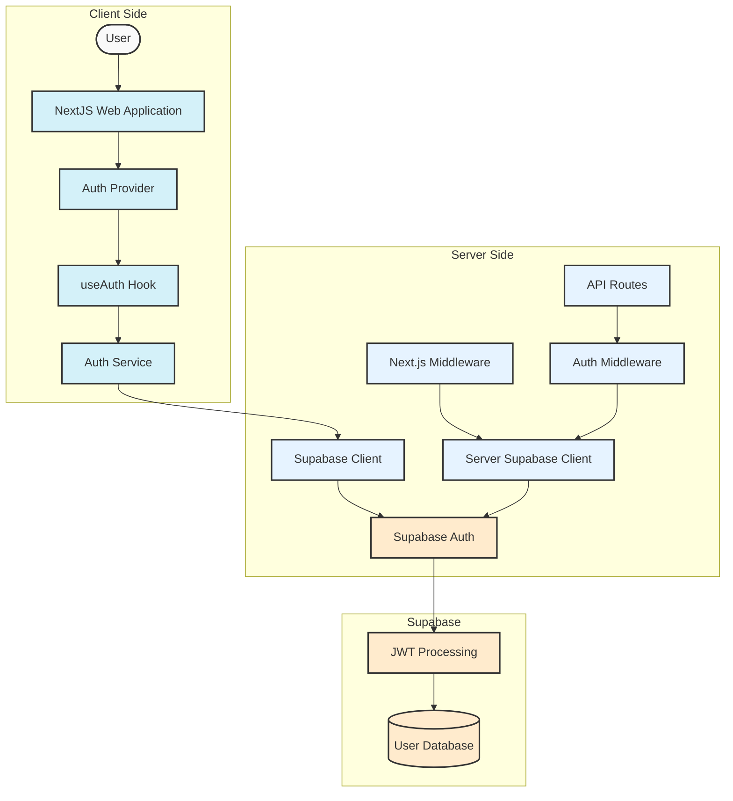
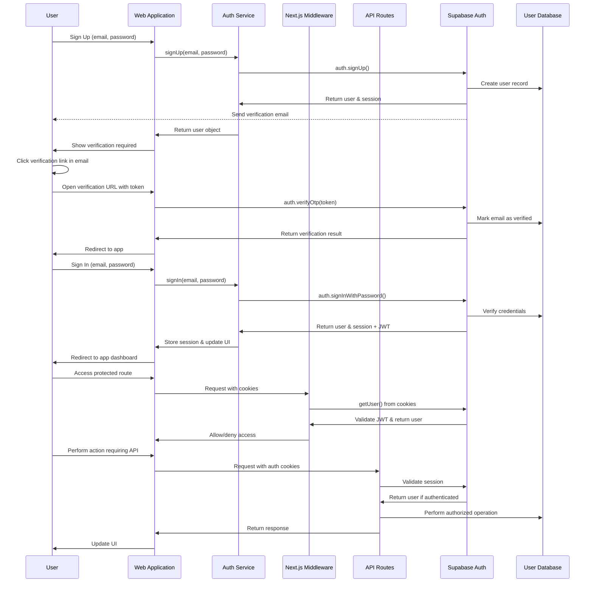

# Authentication Flow Document for Infina PFA

## Overview

This document outlines the authentication architecture and flows for the Infina Personal Financial Advisor platform. The authentication system is built on Supabase Authentication with JWT tokens, providing a secure and scalable solution for user identity management.

## Architecture Components

### Client-Side Components

1. **Auth Provider (`AuthProvider.tsx`)**

   - React Context provider that manages authentication state
   - Initializes authentication on app load
   - Provides auth state to all components

2. **Auth Hook (`useAuth.ts`)**

   - Custom React hook for authentication operations
   - Exposes methods for sign-in, sign-up, sign-out, and password management
   - Handles auth state and loading states

3. **Auth Service (`auth.service.ts`)**
   - Service layer that interfaces with Supabase Auth
   - Centralizes authentication logic and error handling
   - Provides consistent API for auth operations

### Server-Side Components

1. **Middleware (`middleware.ts`)**

   - Intercepts all requests to validate authentication
   - Updates session cookies
   - Handles redirects for protected routes

2. **Auth Middleware (`auth-middleware.ts`)**

   - Utility for API routes to authenticate requests
   - Returns standardized responses for auth failures

3. **Server Supabase Client (`supabase/server.ts`)**
   - Server-side Supabase client for auth operations
   - Handles cookie management for server components

### External Components

1. **Supabase Authentication**
   - Manages user identities and sessions
   - Handles email verification and password resets
   - Issues and validates JWT tokens

## Authentication Flow Diagrams

### System Architecture

### Authentication Sequence Flow

### Authentication Process Flows

```mermaid
flowchart TD
    subgraph "Authentication Flows"
        direction TB

        subgraph "Sign Up Flow"
            SU1[User enters email & password] --> SU2[Form validation]
            SU2 --> SU3[Call Supabase auth.signUp]
            SU3 --> SU4[Email verification sent]
            SU4 --> SU5[User clicks email link]
            SU5 --> SU6[Verify OTP token]
            SU6 --> SU7[Account activated]
        end

        subgraph "Sign In Flow"
            SI1[User enters credentials] --> SI2[Form validation]
            SI2 --> SI3[Call Supabase auth.signInWithPassword]
            SI3 --> SI4[JWT stored in cookies]
            SI4 --> SI5[Auth state updated]
            SI5 --> SI6[Redirect to app]
        end

        subgraph "Password Reset Flow"
            PR1[User requests password reset] --> PR2[Reset email sent]
            PR2 --> PR3[User clicks reset link]
            PR3 --> PR4[User enters new password]
            PR4 --> PR5[Call auth.updateUser]
            PR5 --> PR6[Password updated]
        end

        subgraph "Session Management"
            SM1[Auth provider initializes] --> SM2[Get session from cookies]
            SM2 --> SM3[Subscribe to auth state changes]
            SM3 --> SM4[Update UI based on auth state]
        end
    end

    classDef flowClass fill:#f5f5f5,stroke:#333,stroke-width:2px
    class SU1,SU2,SU3,SU4,SU5,SU6,SU7,SI1,SI2,SI3,SI4,SI5,SI6,PR1,PR2,PR3,PR4,PR5,PR6,SM1,SM2,SM3,SM4 flowClass
```

## Authentication Flows

### Sign-Up Flow

1. User enters email and password in the sign-up form
2. Client-side validation is performed
3. `useAuth.signUp()` is called, which invokes `authService.signUp()`
4. Supabase creates a new user record (unverified)
5. Verification email is sent to the user
6. User clicks the verification link in the email
7. The verification page processes the token via `auth.verifyOtp()`
8. User account is marked as verified
9. User is redirected to the application

### Sign-In Flow

1. User enters email and password in the sign-in form
2. Client-side validation is performed
3. `useAuth.signIn()` is called, which invokes `authService.signIn()`
4. Supabase validates credentials and returns a session with JWT
5. JWT is stored in cookies
6. Auth state is updated via the Auth Provider
7. User is redirected to the application dashboard

### Session Management

1. On application load, Auth Provider initializes
2. `authService.getCurrentUser()` retrieves the current session
3. Auth Provider subscribes to auth state changes
4. When auth state changes, UI updates accordingly
5. Middleware validates JWT on each request
6. Protected routes are secured based on authentication status

### Password Reset Flow

1. User requests a password reset via the forgot password form
2. `useAuth.forgotPassword()` is called, which invokes `authService.forgotPassword()`
3. Supabase sends a password reset email to the user
4. User clicks the reset link in the email
5. User enters a new password
6. `useAuth.resetPassword()` is called, which invokes `authService.resetPassword()`
7. Password is updated and user can sign in with the new credentials

## API Authentication

1. Client makes a request to an API endpoint with auth cookies
2. Next.js middleware intercepts the request
3. Middleware validates the session via Supabase
4. If authenticated, the request proceeds to the API route
5. API route uses `authenticateUser()` to get the user object
6. API operations are performed with the authenticated user context
7. Response is returned to the client

## Security Considerations

1. **JWT Security**

   - Short-lived tokens with automatic refresh
   - Secure, HTTP-only cookies
   - CSRF protection

2. **Password Security**

   - Minimum password requirements enforced
   - Secure password reset flow
   - Rate limiting on authentication attempts

3. **Session Management**
   - Automatic session refresh
   - Ability to revoke sessions
   - Session timeout for inactivity

## Error Handling

1. **Centralized Error Handling**

   - All authentication errors are processed through `handleError()`
   - User-friendly error messages with i18n support
   - Consistent error format across the application

2. **Common Error Scenarios**
   - Invalid credentials
   - Email already in use
   - Unverified email
   - Password requirements not met
   - Session expired

## Implementation Notes

1. **Supabase Configuration**

   - Email templates for verification and password reset are customized
   - Authentication settings are managed via Supabase dashboard
   - JWT expiration is set to balance security and user experience

2. **Route Protection**

   - Public routes: Landing page, sign-in, sign-up, password reset
   - Protected routes: Dashboard, budgeting, goals, chat, settings
   - Special routes: Onboarding (accessible only to authenticated users without profiles)

3. **Future Enhancements**
   - Social authentication providers
   - Multi-factor authentication
   - Role-based access control
   - Enhanced security monitoring

This authentication system provides a secure, scalable foundation for the Infina Personal Financial Advisor platform, following industry best practices and the architecture principles outlined in the system overview document.

