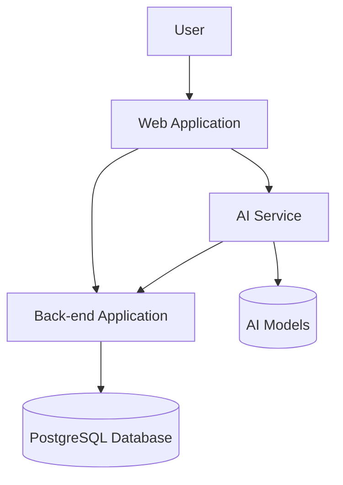

# Infina Personal Financial Advisor Architecture

## System Overview

Infina Personal Financial Advisor is a comprehensive financial management platform with AI-powered advisory capabilities. The system consists of three main components:

1. **Web Application**: User-facing NextJS application
2. **Back-end Application**: NestJS service with business logic and data management
3. **AI Service**: Python-based AI advisor service

### System Integration Diagram

## Web Application

### Technology Stack

- **Framework**: NextJS
- **Authentication**: Supabase authentication
- **State Management**: React Context, SWR for data fetching
- **UI Components**: Custom component library with responsive design

### Key Features

#### Landing Page & Content

- Product introduction and value proposition
- SEO-optimized content
- Blog articles and educational resources
- User testimonials and success stories

#### AI Advisor Interface

- Interactive chat interface with AI financial advisor
- Voice interaction capabilities (future)
- Dynamic form components for data collection
- Visualization tools for financial data
- Personalized recommendations display

#### Financial Management UI

- Dashboard with financial overview
- Budget management interfaces
- Goal tracking and visualization
- Income and expense management
- Reports and analytics

### User Experience

- Responsive design for all devices
- Accessibility compliance
- Internationalization support
- Guided user onboarding

## Back-end Application

### Technology Stack

- **Framework**: NestJS
- **Database ORM**: Prisma
- **Caching**: Redis
- **Authentication**: JWT
- **Database**: PostgreSQL (hosted on Supabase)

### Architecture Pattern

- Domain-Driven Design (DDD)
- Clean Architecture principles

### Core Modules

#### Common Module

- Base entities and repositories
- Guards and interceptors
- Decorators and utilities
- Reusable use cases

#### User Module

- User profile management
- Authentication and authorization
- Preferences and settings
- Activity tracking

#### Budgeting Module

- Budget creation and management
- Expense tracking and categorization
- Income management
- Financial reporting

#### Goal Module

- Financial goal definition
- Progress tracking
- Milestone management
- Achievement recognition

#### Debt Module (Future)

- Debt tracking and management
- Repayment strategies
- Interest calculations
- Consolidation options

### API Design

- RESTful API design with consistent patterns
- OpenAPI/Swagger documentation
- Versioned endpoints
- Rate limiting and throttling

### Error Handling

- Standardized error responses
- Detailed logging for troubleshooting
- Graceful degradation for dependencies

### Performance Optimization

- Query optimization
- Selective data fetching
- Pagination for large datasets

### Testing Strategy

- Unit tests for domain logic
- Integration tests for API endpoints
- End-to-end tests for critical flows

### Data Management

- Comprehensive validation
- Audit trails for financial operations
- Data retention policies

### Background Processing

- Queue-based task processing
- Scheduled jobs for recurring operations
- Retry mechanisms for failed operations

## AI Service

### Technology Stack

- **Language**: Python
- **AI Framework**: OpenAI API
- **API Framework**: FastAPI or Flask

### Responsibilities

- Process natural language requests from users
- Maintain conversation context and user history
- Generate personalized financial advice
- Interact with back-end for user financial data
- Provide structured responses for UI rendering

### Features

- Context-aware conversations
- Personalized financial recommendations
- Dynamic tool usage based on user needs
- Memory management for long-term user context

## Security Considerations

### Authentication & Authorization

- **Web Application**: Supabase authentication for user identity management
- **Back-end**: JWT-based authentication with role-based access control
- **API Security**: Rate limiting, request validation, and API keys for service-to-service communication
- **AI Service**: Secure API endpoints with authentication tokens

### Data Protection

- End-to-end encryption for sensitive financial data, including:
  - Banking connection credentials
  - Account numbers and financial institution details
  - Transaction history details
  - Personal financial goals and debt information
- Secure storage of user financial profiles
- Data masking for logs and non-production environments
- Secure storage of API keys and credentials using AWS Secrets Manager

### Compliance

- Basic data privacy practices following industry standards
- Regular security reviews of code and infrastructure
- Clear user data handling policies in Terms of Service

## Scalability Strategy

### AWS ECS Implementation

- Containerized services deployed on AWS ECS
- Auto-scaling groups based on CPU/memory utilization
- Application Load Balancer for traffic distribution
- Task definitions optimized for service requirements

### Database Scaling

- Read replicas for high-traffic read operations when needed
- Connection pooling to optimize database performance
- Monitoring database performance for future optimization

### Caching Strategy (Future Phase)

- Initial focus on architecture and functionality
- Identified future caching points:
  - Frequent API responses
  - User profile data
  - Common financial calculations

## Monitoring & Observability

### Supabase Integration

- Utilizing Supabase built-in monitoring for database operations
- Database query performance tracking
- Authentication events monitoring
- Storage usage metrics

### Additional Monitoring

- AWS CloudWatch for ECS container metrics
- Application health checks
- Error logging with appropriate severity levels
- Correlation IDs for request tracing

### Alerting

- Critical error notifications via email
- Service availability alerts
- Basic dashboard for system status overview

## Deployment Pipeline

### Development Workflow

- Feature branch development
- Pull request reviews
- Automated testing
- Continuous integration

### Environments

- Development
- Staging/QA
- Production

### Deployment Process

- Automated builds
- Container image creation
- Infrastructure as Code
- Blue/green deployment strategy

## Future Considerations

### Feature Roadmap

- Advanced financial analytics
- Integration with banking institutions
- Mobile application
- Expanded AI capabilities

### Technical Debt Management

- Regular refactoring cycles
- Performance optimization phases
- Documentation updates
- Security reviews
