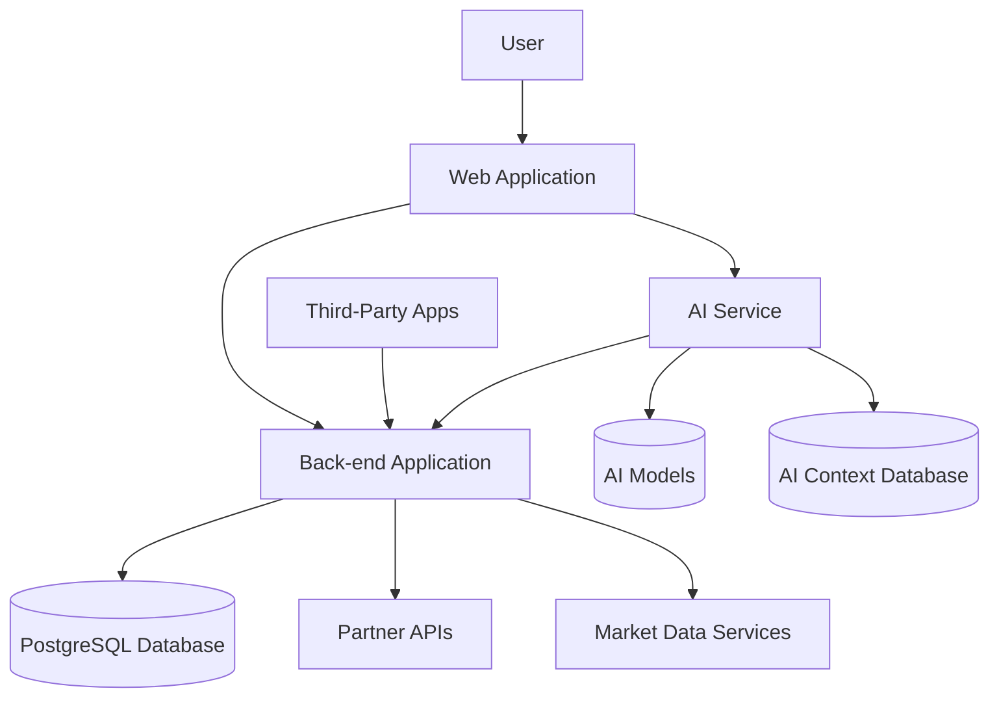

# Infina Personal Financial Advisor Architecture

## System Overview

Infina Personal Financial Advisor is a comprehensive financial management platform with AI-powered advisory capabilities. The system is designed to support both current and future financial management features through a scalable, extensible architecture.

### Core Capabilities

**Current Features:**

- AI-powered financial advice and planning
- Budget management and expense tracking
- Financial goal setting and tracking
- Income management
- Basic financial reporting and analytics

**Planned Future Features:**

- Asset management (stocks, funds, gold, real estate)
- High-yield savings partner integrations
- Third-party application integrations
- Investment advisory services
- Comprehensive financial analytics

### System Components

The platform consists of three main components:

1. **Web Application**: User-facing NextJS application
2. **Back-end Application**: NestJS service with business logic and data management
3. **AI Service**: Python-based AI advisor service

### System Integration Diagram

## Web Application

### Technology Stack

- **Framework**: NextJS
- **Authentication**: Supabase authentication
- **State Management**: React Context, SWR for data fetching
- **UI Components**: Custom component library based on shadcn with design guidelines
- **Styling**: Tailwind CSS

### Key Features

#### Landing Page & Content

- Product introduction and value proposition
- SEO-optimized content
- Blog articles and educational resources
- User testimonials and success stories

#### AI Advisor Interface

- Interactive chat interface with AI financial advisor
- Voice interaction capabilities (future)
- Dynamic form components for data collection
- Advanced visualization components for financial data presentation
- Interactive charts and graphs for financial analysis
- Timeline visualizations for financial goals and projections
- Personalized recommendations display

#### Financial Management UI

- Dashboard with comprehensive financial overview
- Budget management interfaces
- Goal tracking and visualization
- Income and expense management
- Asset portfolio management (future)
- Investment performance tracking (future)
- Reports and analytics

### User Experience

- Responsive design for all devices
- Accessibility compliance
- Internationalization support
- Guided user onboarding
- Personalized user journeys based on financial stage

## Back-end Application

### Technology Stack

- **Framework**: NestJS
- **Database ORM**: Prisma
- **Caching**: Redis
- **Authentication**: JWT
- **Database**: PostgreSQL (hosted on Supabase)

### Architecture Pattern

- Domain-Driven Design (DDD)
- Clean Architecture principles
- Event-driven architecture for cross-domain communication

### Core Modules

#### Common Module

- Base entities and repositories
- Guards and interceptors
- Decorators and utilities
- Reusable use cases

#### User Module

- User profile management
- Authentication and authorization
- Preferences and settings
- Activity tracking
- Financial risk profile assessment (future)

#### Budgeting Module

- Budget creation and management
- Expense tracking and categorization
- Income management
- Financial reporting

#### Goal Module

- Financial goal definition
- Progress tracking
- Milestone management
- Achievement recognition

#### Asset Management Module (Future)

- Multi-asset class portfolio tracking
- Asset performance monitoring
- Transaction history
- Asset allocation analysis

#### Investment Module (Future)

- Investment recommendations
- Portfolio performance tracking
- Market data integration
- Risk assessment

#### Partner Integration Module (Future)

- API adapters for financial partners
- Account linking and management
- Transaction synchronization
- Offer management

#### Debt Module (Future)

- Debt tracking and management
- Repayment strategies
- Interest calculations
- Consolidation options

### API Design

- RESTful API design with consistent patterns
- OpenAPI/Swagger documentation
- Versioned endpoints
- Rate limiting and throttling
- OAuth2 support for third-party integrations (future)

### Error Handling

- Standardized error responses
- Detailed logging for troubleshooting
- Graceful degradation for dependencies

### Performance Optimization

- Query optimization
- Selective data fetching
- Pagination for large datasets
- Caching strategies for frequently accessed data

### Testing Strategy

- Unit tests for domain logic
- Integration tests for API endpoints
- End-to-end tests for critical flows
- Performance testing for high-load scenarios

### Data Management

- Comprehensive validation
- Audit trails for financial operations
- Data retention policies
- Data aggregation for analytics

### Background Processing

- Queue-based task processing
- Scheduled jobs for recurring operations
- Retry mechanisms for failed operations
- Batch processing for data-intensive operations

## AI Service

### Technology Stack

- **Language**: Python
- **AI Framework**: OpenAI API
- **API Framework**: FastAPI or Flask
- **Database**: Dedicated database for context storage and conversation history

### Responsibilities

- Process natural language requests from users
- Maintain conversation context and user history
- Generate personalized financial advice
- Interact with back-end for user financial data
- Provide structured responses for UI rendering

### Features

- Context-aware conversations
- Personalized financial recommendations
- Dynamic tool usage based on user needs
- Memory management for long-term user context
- Domain-specific knowledge for various financial topics

### Future AI Capabilities

- Investment strategy recommendations
- Asset allocation optimization
- Risk assessment and management
- Market trend analysis
- Financial education and coaching

## Security Considerations

### Authentication & Authorization

- **Web Application**: Supabase authentication for user identity management
- **Back-end**: JWT-based authentication with role-based access control
- **API Security**: Rate limiting, request validation, and API keys for service-to-service communication
- **AI Service**: Secure API endpoints with authentication tokens
- **Partner Integrations**: OAuth2 and secure credential management (future)

### Data Protection

- End-to-end encryption for sensitive financial data, including:
  - Banking connection credentials
  - Account numbers and financial institution details
  - Transaction history details
  - Personal financial goals and debt information
  - Investment account information (future)
- Secure storage of user financial profiles
- Data masking for logs and non-production environments
- Secure storage of API keys and credentials using AWS Secrets Manager

### Compliance

- Basic data privacy practices following industry standards
- Regular security reviews of code and infrastructure
- Clear user data handling policies in Terms of Service
- Financial advisory regulations compliance (future)
- Investment service regulations compliance (future)

## Scalability Strategy

### AWS ECS Implementation

- Containerized services deployed on AWS ECS
- Auto-scaling groups based on CPU/memory utilization
- Application Load Balancer for traffic distribution
- Task definitions optimized for service requirements

### Database Scaling

- Read replicas for high-traffic read operations
- Connection pooling to optimize database performance
- Monitoring database performance for optimization
- Database sharding for future growth (if needed)

### Caching Strategy

- Initial focus on architecture and functionality
- Redis implementation for frequently accessed data
- Identified caching points:
  - Frequent API responses
  - User profile data
  - Common financial calculations
  - Market data (future)

### Integration Scaling

- API gateway for managing multiple partner integrations
- Queue-based processing for high-volume partner data
- Throttling and backpressure mechanisms for traffic spikes

## Monitoring & Observability

### Supabase Integration

- Utilizing Supabase built-in monitoring for database operations
- Database query performance tracking
- Authentication events monitoring
- Storage usage metrics

### Additional Monitoring

- AWS CloudWatch for ECS container metrics
- Application health checks
- Error logging with appropriate severity levels
- Correlation IDs for request tracing
- Business metrics dashboards for key performance indicators

### Alerting

- Critical error notifications via email
- Service availability alerts
- Basic dashboard for system status overview
- Anomaly detection for unusual patterns

## Deployment Pipeline

### Development Workflow

- Feature branch development
- Pull request reviews
- Automated testing
- Continuous integration

### Environments

- Development
- Staging/QA
- Production

### Deployment Process

- Automated builds
- Container image creation
- Infrastructure as Code
- Blue/green deployment strategy

## Extensibility Framework

### Domain Extension Pattern

- New financial domains can be added as bounded contexts
- Consistent API patterns across domains
- Shared common services and utilities
- Domain-specific data models and business logic

### Partner Integration Framework

- Standardized adapter pattern for new partners
- Credential management system
- Webhook processing infrastructure
- Partner-specific rate limiting and monitoring

### Third-Party Application Support

- API documentation and developer portal (future)
- SDK development for common platforms
- OAuth2 authentication for third-party apps
- Usage monitoring and analytics

### Data Exchange Standards

- Consistent data formats across services
- Standardized event schemas
- Versioned API contracts
- Data transformation services

## Implementation Roadmap

### Phase 1: Core Financial Management

- Basic budgeting and expense tracking
- Financial goal setting
- AI-powered financial advice
- Core user experience

### Phase 2: Enhanced Analytics

- Advanced reporting
- Trend analysis
- Personalized insights
- Improved AI recommendations

### Phase 3: Asset Management

- Multi-asset portfolio tracking
- Performance monitoring
- Basic investment insights
- Asset allocation visualization

### Phase 4: Partner Integrations

- High-yield savings partners
- Investment platform connections
- Banking integrations
- Insurance partner offerings

### Phase 5: Advanced Investment Advisory

- Automated investment recommendations
- Risk-adjusted portfolio optimization
- Market analysis and insights
- Comprehensive wealth management

## Technical Debt Management

- Regular refactoring cycles
- Performance optimization phases
- Documentation updates
- Security reviews
- Architecture evolution planning
