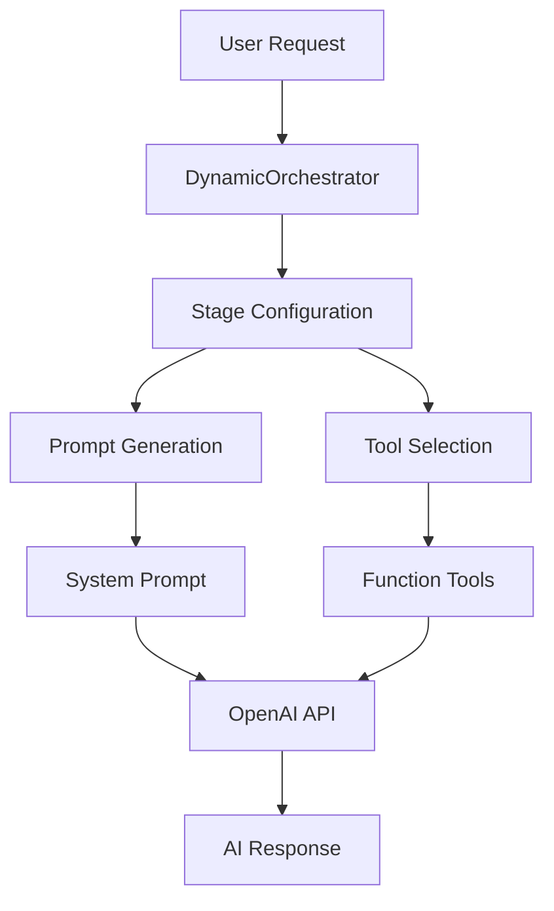

# Prompt Orchestrator Documentation Guideline

## Table of Contents

1. [Overview](#overview)
2. [Architecture](#architecture)
3. [Core Components](#core-components)
4. [Configuration Management](#configuration-management)
5. [API Reference](#api-reference)
6. [Usage Examples](#usage-examples)
7. [Implementation Guidelines](#implementation-guidelines)
8. [Best Practices](#best-practices)
9. [Troubleshooting](#troubleshooting)

## Overview

The **Prompt Orchestrator** is a sophisticated system that dynamically generates AI prompts and tool configurations based on:
- **Financial Stage**: `DEBT`, `START_SAVING`, `START_INVESTING`
- **Budget Style**: `GOAL_FOCUSED`, `DETAIL_TRACKER`
- **Context**: User information, memory, and financial data

### Key Benefits

- **Dynamic Prompt Generation**: Automatically selects appropriate prompts based on user context
- **Stage-Specific Tools**: Provides relevant tools for each financial stage
- **Consistent Architecture**: Unified approach to prompt management across the application
- **Scalable Design**: Easy to add new stages and budget styles

## Architecture

### High-Level Architecture



### Core Classes

#### 1. DynamicOrchestrator (`lib/ai-advisor/config/orchestrator.ts`)

The main orchestration class that coordinates all prompt and tool generation:

```typescript
export class DynamicOrchestrator {
  // Static configuration loaded from stage utilities
  private static stageConfigurations: StageConfigurations;
  
  // Core methods for dynamic orchestration
  static getStagePrompt(stage, budgetStyle, context?, toolInfo?): string
  static getStageTools(stage, budgetStyle): StageToolConfiguration
  static getLLMConfiguration(stage, budgetStyle, context?): LLMConfig
  static getSystemPrompt(userId, stage, budgetStyle, context?): string
  static getAvailableTools(stage, budgetStyle): Tool[]
  static validateConfiguration(): boolean
}
```

#### 2. Stage Configurations (`lib/ai-advisor/config/stage-configurations.ts`)

Manages the configuration mapping between financial stages, budget styles, and their corresponding prompts/tools:

```typescript
interface StageConfig {
  prompts: {
    [key in BudgetStyle]: (context?: string, toolInfo?: string) => string;
  };
  tools: {
    [key in BudgetStyle]: StageToolConfiguration;
  };
}

interface StageToolConfiguration {
  chatTools: ChatToolId[];       // Interactive tools (calculators, etc.)
  componentTools: ChatComponentId[];  // UI components (dashboards, etc.)
  mcpTools: MCPId[];            // MCP (Model Context Protocol) tools
}
```

## Core Components

### 1. Financial Stages

#### DEBT Stage
- **Focus**: Debt elimination and financial foundation
- **Goal**: Pay off high-interest debt before building savings
- **Tools**: Loan calculators, debt tracking, budget analysis

#### START_SAVING Stage  
- **Focus**: Emergency fund building (3-month income target)
- **Goal**: Establish financial safety net
- **Tools**: Goal tracking, savings confirmation, budget management

#### START_INVESTING Stage
- **Focus**: Begin investment journey
- **Goal**: Start wealth building with proper foundation
- **Tools**: Investment education, portfolio tracking, risk assessment

### 2. Budget Styles

#### GOAL_FOCUSED
- **Approach**: Milestone-driven, achievement-oriented
- **Tools**: Minimal, focused on progress tracking
- **UI**: Simple dashboards, goal visualization

#### DETAIL_TRACKER
- **Approach**: Data-driven, comprehensive analysis
- **Tools**: Extensive calculators and tracking tools
- **UI**: Detailed analytics, comprehensive reporting

### 3. Tool Categories

#### Chat Tools (`ChatToolId`)
Interactive financial tools that users can open:
- `BUDGET_TOOL`: Budget creation and management
- `LOAN_CALCULATOR`: Loan payment calculations
- `INTEREST_CALCULATOR`: Savings interest calculations
- `SALARY_CALCULATOR`: Salary and tax calculations

#### Component Tools (`ChatComponentId`)
UI components displayed in chat:
- `GOAL_DASHBOARD`: Emergency fund progress tracking
- `BUDGETING_DASHBOARD`: Monthly budget overview
- `PAY_YOURSELF_FIRST_CONFIRMATION`: Monthly savings confirmation
- `MONTHLY_BUDGET_ANALYSIS`: End-of-month analysis
- `SUGGESTIONS`: Action suggestions for users

#### MCP Tools (`MCPId`)
Model Context Protocol tools for advanced functionality:
- `GENERAL`: General financial management tools

### 4. Core Prompt Components

Located in `lib/prompts/core/`:

#### Identity Prompt (`identity.prompt.ts`)
Defines the AI's persona as "Fina":
- Vietnamese financial advisor
- Empathetic and encouraging tone
- Privacy-focused approach
- Stage-specific expertise

#### Guiding Principles (`guiding-principle.prompt.ts`)
Core behavioral principles:
- **Respond Before Acting**: Always inform user before tool calls
- **One Answer Principle**: Provide focused recommendations
- **Prompt Injection Defense**: Security against manipulation
- **Goal-Centric Communication**: Keep focus on user's current stage

#### Response Instructions (`response.prompt.ts`)
Structured response format:
- 6-step thinking process
- Tone guidelines (motivating, non-judgmental)
- Response structure (acknowledge, evidence, goal-link, action)

#### Complete Interaction Examples (`complete-interact.prompt.ts`)
End-to-end interaction examples showing:
- Proactive monthly behaviors
- Tool usage patterns
- Error handling approaches
- Security response patterns

## Configuration Management

### Stage Utilities

Each financial stage has its own utility module:

#### Debt Stage (`lib/prompts/debt/utils.ts`)
```typescript
export const getDebtPrompt = (options?: {
  context?: string;
  toolInfo?: string;
  budgetStyle: BudgetStyle;
}) => string;

export const getDebtTools = (options?: {
  budgetStyle: BudgetStyle;
}) => StageToolConfiguration;
```

#### Start Saving Stage (`lib/prompts/start-saving/chat/utils.ts`)
```typescript
export const getStartSavingPrompt = (options?: {
  context?: string;
  toolInfo?: string;
  budgetStyle: BudgetStyle;
}) => string;

export const getStartSavingTools = (options?: {
  budgetStyle: BudgetStyle;
}) => StageToolConfiguration;
```

#### Start Investing Stage (`lib/prompts/start-investing/utils.ts`)
```typescript
export const getStartInvestingPrompt = (options?: {
  context?: string;
  toolInfo?: string;
  budgetStyle: BudgetStyle;
}) => string;

export const getStartInvestingTools = (options?: {
  budgetStyle: BudgetStyle;
}) => StageToolConfiguration;
```

### Configuration Initialization

The stage configurations are initialized in `lib/prompts/index.ts`:

```typescript
import * as debtUtils from "./debt/utils";
import * as startInvestingUtils from "./start-investing/utils";
import * as startSavingUtils from "./start-saving/chat/utils";
import { getStageConfigurations } from "../ai-advisor/config/stage-configurations";

// Initialize stage configurations with all utilities
getStageConfigurations(debtUtils, startSavingUtils, startInvestingUtils);
```

## API Reference

### DynamicOrchestrator Methods

#### `getStagePrompt(stage, budgetStyle, context?, toolInfo?): string`
Retrieves the stage-specific prompt for a given configuration.

**Parameters:**
- `stage: FinancialStage` - The user's financial stage
- `budgetStyle: BudgetStyle` - The user's preferred budget style
- `context?: string` - Optional user context information
- `toolInfo?: string` - Optional tool information for prompt context

**Returns:** String containing the stage-specific prompt

**Example:**
```typescript
const prompt = DynamicOrchestrator.getStagePrompt(
  FinancialStage.START_SAVING,
  BudgetStyle.GOAL_FOCUSED,
  "User has $1000 saved",
  "Budget tool available"
);
```

#### `getStageTools(stage, budgetStyle): StageToolConfiguration`
Retrieves the tools configuration for a stage/style combination.

**Parameters:**
- `stage: FinancialStage` - The user's financial stage
- `budgetStyle: BudgetStyle` - The user's preferred budget style

**Returns:** `StageToolConfiguration` object with chat, component, and MCP tools

**Example:**
```typescript
const tools = DynamicOrchestrator.getStageTools(
  FinancialStage.START_SAVING,
  BudgetStyle.DETAIL_TRACKER
);
console.log(tools.chatTools); // [ChatToolId.BUDGET_TOOL, ChatToolId.SALARY_CALCULATOR]
```

#### `getLLMConfiguration(stage, budgetStyle, context?): LLMConfig`
Gets complete LLM configuration including prompts and function tools.

**Parameters:**
- `stage: FinancialStage` - The user's financial stage
- `budgetStyle: BudgetStyle` - The user's preferred budget style
- `context?: string` - Optional context for prompt generation

**Returns:** Complete LLM configuration object

**Example:**
```typescript
const config = DynamicOrchestrator.getLLMConfiguration(
  FinancialStage.DEBT,
  BudgetStyle.GOAL_FOCUSED,
  "User has $5000 credit card debt"
);
```

#### `getSystemPrompt(userId, stage, budgetStyle, context?): string`
Generates the complete system prompt for OpenAI API.

**Parameters:**
- `userId: string` - User identifier
- `stage: FinancialStage` - The user's financial stage
- `budgetStyle: BudgetStyle` - The user's preferred budget style
- `context?: object` - Context object with memory, user, and financial information

**Returns:** Complete system prompt string

**Example:**
```typescript
const systemPrompt = DynamicOrchestrator.getSystemPrompt(
  "user123",
  FinancialStage.START_SAVING,
  BudgetStyle.GOAL_FOCUSED,
  {
    memory: "User mentioned wanting to save for vacation",
    user: "25-year-old software engineer",
    financial: "Monthly income: $5000"
  }
);
```

#### `getAvailableTools(stage, budgetStyle): Tool[]`
Returns OpenAI function tools for the specified configuration.

**Parameters:**
- `stage: FinancialStage` - The user's financial stage
- `budgetStyle: BudgetStyle` - The user's preferred budget style

**Returns:** Array of OpenAI-compatible function tools

#### `validateConfiguration(): boolean`
Validates that all stage/style combinations have valid configurations.

**Returns:** `true` if all configurations are valid, `false` otherwise

## Usage Examples

### Basic Usage in Service

```typescript
import { DynamicOrchestrator } from "@/lib/ai-advisor/config/orchestrator";
import { FinancialStage, BudgetStyle } from "@/lib/types/user.types";

export class AIAdvisorService {
  async processRequest(userId: string, message: string, user: User) {
    // Get user's financial stage and budget style
    const userStage = user.financial_stage || FinancialStage.START_SAVING;
    const userBudgetStyle = user.budget_style || BudgetStyle.GOAL_FOCUSED;

    // Get LLM configuration
    const llmConfig = DynamicOrchestrator.getLLMConfiguration(
      userStage,
      userBudgetStyle,
      userContext
    );

    // Generate system prompt
    const systemPrompt = DynamicOrchestrator.getSystemPrompt(
      userId,
      userStage,
      userBudgetStyle,
      {
        memory: memoryContext,
        user: userContext,
        financial: JSON.stringify(financialData)
      }
    );

    // Use tools and prompt with OpenAI API
    return this.processOpenAIStream(
      messages,
      llmConfig.tools,
      systemPrompt
    );
  }
}
```

### Adding a New Financial Stage

1. **Create stage utility file:**
```typescript
// lib/prompts/wealth-building/utils.ts
export const getWealthBuildingPrompt = (options?: {
  context?: string;
  toolInfo?: string;
  budgetStyle: BudgetStyle;
}) => {
  const { context, toolInfo, budgetStyle } = options || {};
  
  switch (budgetStyle) {
    case BudgetStyle.GOAL_FOCUSED:
      return getGoalFocusedWealthPrompt(context, toolInfo);
    case BudgetStyle.DETAIL_TRACKER:
      return getDetailTrackerWealthPrompt(context, toolInfo);
    default:
      return getGoalFocusedWealthPrompt(context, toolInfo);
  }
};

export const getWealthBuildingTools = (options?: {
  budgetStyle: BudgetStyle;
}) => {
  const { budgetStyle } = options || {};
  
  switch (budgetStyle) {
    case BudgetStyle.GOAL_FOCUSED:
      return {
        chatTools: [],
        componentTools: [ChatComponentId.INVESTMENT_DASHBOARD],
        mcpTools: [MCPId.GENERAL]
      };
    // ... other cases
  }
};
```

2. **Update FinancialStage enum:**
```typescript
export enum FinancialStage {
  DEBT = "debt",
  START_SAVING = "start_saving",
  START_INVESTING = "start_investing",
  WEALTH_BUILDING = "wealth_building", // New stage
}
```

3. **Register in configuration:**
```typescript
// lib/prompts/index.ts
import * as wealthBuildingUtils from "./wealth-building/utils";

getStageConfigurations(
  debtUtils, 
  startSavingUtils, 
  startInvestingUtils,
  wealthBuildingUtils // Add new utility
);
```

### Tool Integration Example

```typescript
// In your AI service
const llmConfig = DynamicOrchestrator.getLLMConfiguration(
  FinancialStage.START_SAVING,
  BudgetStyle.DETAIL_TRACKER
);

// Tools are automatically configured based on stage/style
console.log(llmConfig.stageTools);
// Output:
// {
//   chatTools: [ChatToolId.BUDGET_TOOL, ChatToolId.SALARY_CALCULATOR],
//   componentTools: [
//     ChatComponentId.VIDEO,
//     ChatComponentId.SUGGESTIONS,
//     ChatComponentId.GOAL_DASHBOARD,
//     ChatComponentId.PAY_YOURSELF_FIRST_CONFIRMATION,
//     ChatComponentId.BUDGETING_DASHBOARD
//   ],
//   mcpTools: [MCPId.GENERAL]
// }
```

## Implementation Guidelines

### 1. Stage-Specific Prompt Development

When creating prompts for a new stage:

#### Structure Requirements
- Use consistent XML-style tags for organization
- Include stage description and core philosophy
- Define clear step-by-step strategies
- Specify conversation style and tone
- Document component usage patterns
- Define success metrics

#### Example Structure
```typescript
export function getGoalFocusedDebtPrompt(context?: string, toolInfo?: string) {
  return `
    <stage_description>
      The user is in the DEBT stage with a GOAL-FOCUSED budget style.
      Focus on clear milestones, progress tracking, and strategic debt payoff goals.
    </stage_description>
    
    <core_philosophy>
      <priority>Debt elimination is the absolute priority</priority>
      <approach>Goal-focused approach with clear milestones</approach>
      <mindset>Frame debt elimination as achieving freedom</mindset>
    </core_philosophy>
    
    <debt_elimination_strategy>
      <step_1_goal_setting>
        <objective>Set clear, measurable debt elimination goals</objective>
        <actions>
          - Create debt-free target date
          - Set monthly payment goals
          - Define milestone celebrations
        </actions>
      </step_1_goal_setting>
      <!-- More steps... -->
    </debt_elimination_strategy>
    
    <goal_focused_features>
      <!-- Stage-specific features -->
    </goal_focused_features>
    
    <conversation_style>
      <tone>Encouraging, goal-oriented, and celebration-focused</tone>
      <language>Use achievement language</language>
    </conversation_style>
    
    <component_usage>
      <goal_dashboard>Use to show debt elimination progress</goal_dashboard>
      <suggestions>Provide goal-focused action items</suggestions>
    </component_usage>
    
    <success_metrics>
      <primary>Debt elimination progress toward zero balance</primary>
      <secondary>Interest savings achieved</secondary>
    </success_metrics>
    
    ${context ? `<user_context>${context}</user_context>` : ""}
    ${toolInfo ? `<available_tools>${toolInfo}</available_tools>` : ""}
  `;
}
```

### 2. Tool Configuration Guidelines

#### Tool Selection Principles
- **Goal-Focused**: Minimal tools, focus on progress tracking
- **Detail-Tracker**: Comprehensive tools for analysis and planning

#### Tool Categories by Stage
```typescript
// DEBT Stage Tools
const debtTools = {
  GOAL_FOCUSED: {
    chatTools: [], // Minimal tools
    componentTools: [GOAL_DASHBOARD, SUGGESTIONS, VIDEO],
    mcpTools: [GENERAL]
  },
  DETAIL_TRACKER: {
    chatTools: [BUDGET_TOOL, SALARY_CALCULATOR, LOAN_CALCULATOR],
    componentTools: [BUDGETING_DASHBOARD, MONTHLY_BUDGET_ANALYSIS],
    mcpTools: [GENERAL]
  }
};
```

### 3. Integration with OpenAI API

The orchestrator generates OpenAI-compatible function tools:

```typescript
// Generated function tools structure
const functionTools = [
  {
    type: "function",
    strict: false,
    name: "open_tool",
    description: "Open a specific financial tool",
    parameters: {
      type: "object",
      properties: {
        tool_id: { type: "string", enum: ["budget-tool", "salary-calculator"] },
        title: { type: "string" },
        context: { type: "object" },
        trigger_reason: { type: "string" }
      },
      required: ["tool_id", "title", "trigger_reason"]
    }
  },
  {
    type: "function",
    strict: false,
    name: "show_component",
    description: "Show a specific component",
    parameters: {
      type: "object",
      properties: {
        component_id: { 
          type: "string", 
          enum: ["goal-dashboard", "budgeting-dashboard"] 
        },
        title: { type: "string" },
        context: { type: "object" }
      },
      required: ["component_id", "title"]
    }
  }
];
```

## Best Practices

### 1. Configuration Management

#### ✅ Do's
- Keep stage utilities modular and independent
- Use consistent naming conventions across stages
- Validate configurations on application startup
- Document all tool/component relationships
- Use TypeScript enums for type safety

#### ❌ Don'ts
- Don't hardcode stage configurations
- Don't mix stage-specific logic in the orchestrator
- Don't create circular dependencies between stages
- Don't skip validation of new configurations

### 2. Prompt Development

#### ✅ Do's
- Use structured XML-style organization
- Include context and tool information placeholders
- Test prompts with different budget styles
- Document expected AI behaviors
- Include clear success metrics

#### ❌ Don'ts
- Don't create overly long single prompts
- Don't mix multiple stages in one prompt
- Don't hardcode user-specific information
- Don't ignore budget style differences

### 3. Tool Integration

#### ✅ Do's
- Align tools with stage objectives
- Consider budget style preferences
- Test tool combinations thoroughly
- Document tool usage patterns
- Provide fallback options

#### ❌ Don'ts
- Don't overwhelm goal-focused users with too many tools
- Don't under-provide tools for detail-tracker users
- Don't create tools without clear use cases
- Don't ignore tool performance implications

### 4. Error Handling

#### ✅ Do's
- Validate stage/style combinations
- Provide meaningful error messages
- Log configuration issues
- Have fallback configurations
- Test error scenarios

#### ❌ Don'ts
- Don't fail silently on configuration errors
- Don't expose internal errors to users
- Don't skip validation in production
- Don't ignore missing configurations

## Troubleshooting

### Common Issues

#### 1. Configuration Not Found
**Error:** `No configuration found for stage: [stage]`

**Causes:**
- Stage utility not properly imported
- Missing stage in configuration initialization
- Typo in stage enum value

**Solutions:**
```typescript
// Verify stage utility is imported
import * as newStageUtils from "./new-stage/utils";

// Check configuration initialization
getStageConfigurations(
  debtUtils, 
  startSavingUtils, 
  startInvestingUtils,
  newStageUtils // Ensure new stage is included
);

// Validate enum value
export enum FinancialStage {
  NEW_STAGE = "new_stage", // Must match exactly
}
```

#### 2. Missing Tools for Budget Style
**Error:** Tools array is empty for specific budget style

**Causes:**
- Budget style not handled in switch statement
- Missing tool configuration for style
- Incorrect tool ID enum values

**Solutions:**
```typescript
export const getStageTools = (options?: { budgetStyle: BudgetStyle }) => {
  const { budgetStyle } = options || {};
  
  switch (budgetStyle) {
    case BudgetStyle.GOAL_FOCUSED:
      return { /* valid configuration */ };
    case BudgetStyle.DETAIL_TRACKER:
      return { /* valid configuration */ };
    default:
      // Always provide fallback
      return { 
        chatTools: [],
        componentTools: [],
        mcpTools: []
      };
  }
};
```

#### 3. Prompt Generation Failures
**Error:** Empty or malformed prompts

**Causes:**
- Missing function exports
- Incorrect function signatures
- Template string errors

**Solutions:**
```typescript
// Verify function export
export const getStagePrompt = (options?: {
  context?: string;
  toolInfo?: string;
  budgetStyle: BudgetStyle;
}) => {
  // Ensure function always returns a string
  return `<prompt>${content}</prompt>`;
};

// Check function registration
const stageConfig = {
  prompts: {
    [BudgetStyle.GOAL_FOCUSED]: getGoalFocusedPrompt,
    [BudgetStyle.DETAIL_TRACKER]: getDetailTrackerPrompt,
  },
  // ...
};
```

#### 4. Tool Function Generation Issues
**Error:** Invalid OpenAI function tools

**Causes:**
- Incorrect tool ID enums
- Missing required parameters
- Invalid JSON schema

**Solutions:**
```typescript
// Verify tool ID enums match
export enum ChatToolId {
  BUDGET_TOOL = "budget-tool", // Must match exactly in constant
}

// Check tool definitions
export const CHAT_TOOLS: ChatTool[] = [
  {
    id: ChatToolId.BUDGET_TOOL, // Use enum, not string
    name: "Budget Tool",
    description: "Tool description",
    keywords: ["budget", "planning"]
  }
];
```

### Debugging Tools

#### 1. Configuration Validation
```typescript
// Add to application startup
const isValid = DynamicOrchestrator.validateConfiguration();
if (!isValid) {
  console.error("Orchestrator configuration is invalid!");
  // Handle gracefully
}
```

#### 2. Configuration Inspection
```typescript
// Debug specific configuration
const config = DynamicOrchestrator.getLLMConfiguration(
  FinancialStage.START_SAVING,
  BudgetStyle.GOAL_FOCUSED
);
console.log("Configuration:", {
  promptLength: config.stagePrompt.length,
  toolCount: config.tools.length,
  stageTools: config.stageTools
});
```

#### 3. Prompt Testing
```typescript
// Test prompt generation
const prompt = DynamicOrchestrator.getStagePrompt(
  FinancialStage.DEBT,
  BudgetStyle.DETAIL_TRACKER,
  "Test context",
  "Test tools"
);
console.log("Generated prompt length:", prompt.length);
console.log("Prompt preview:", prompt.substring(0, 200));
```

### Performance Considerations

#### 1. Configuration Caching
The orchestrator uses static configuration caching to avoid repeated initialization:

```typescript
export class DynamicOrchestrator {
  // Cached at class level
  private static stageConfigurations: StageConfigurations =
    getStageConfigurations(debtUtils, startSavingUtils, startInvestingUtils);
}
```

#### 2. Prompt Generation Optimization
- Prompts are generated on-demand
- Context and tool information are optional
- String templates are optimized for performance

#### 3. Tool Array Management
- Tool arrays are pre-configured and cached
- Function tool building is optimized
- Enum-based tool selection ensures type safety

### Testing Guidelines

#### 1. Unit Testing
```typescript
describe('DynamicOrchestrator', () => {
  test('should generate valid configuration for all stage/style combinations', () => {
    const stages = Object.values(FinancialStage);
    const budgetStyles = Object.values(BudgetStyle);
    
    stages.forEach(stage => {
      budgetStyles.forEach(budgetStyle => {
        const config = DynamicOrchestrator.getLLMConfiguration(stage, budgetStyle);
        expect(config.stagePrompt).toBeTruthy();
        expect(config.tools).toBeDefined();
        expect(config.stageTools).toBeDefined();
      });
    });
  });
});
```

#### 2. Integration Testing
```typescript
describe('Orchestrator Integration', () => {
  test('should work with AI service', async () => {
    const service = new AIAdvisorService();
    const config = DynamicOrchestrator.getLLMConfiguration(
      FinancialStage.START_SAVING,
      BudgetStyle.GOAL_FOCUSED
    );
    
    expect(config.tools.length).toBeGreaterThan(0);
    // Test actual AI service integration
  });
});
```

## Conclusion

The Prompt Orchestrator provides a robust, scalable foundation for managing AI prompts and tools across different financial stages and user preferences. By following the guidelines in this document, developers can:

- Effectively use the existing orchestrator system
- Add new financial stages and budget styles
- Maintain consistency across prompt development
- Ensure proper tool integration and configuration
- Debug and troubleshoot common issues

The modular architecture ensures that the system remains maintainable and extensible as new features and stages are added to the Infina PFA platform. 